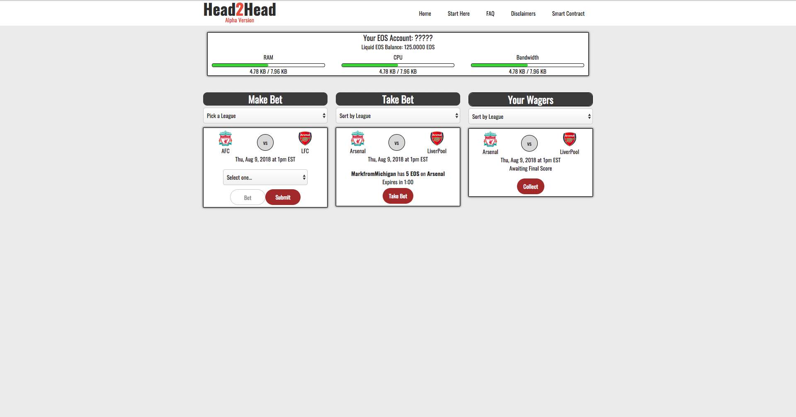

# Head 2 Head

Head 2 Head is a decentralized peer 2 peer sports betting platform on the EOS Blockchain Platform. 
Users can place bets on a specific game and other users can match that bet. 
Built using Angular and EOS C++ smart contracts. 

## How it works
1. User 1 makes a bet based on the winner based on upcoming games.
2. User 2 matches User 1's bet. 
3. Within 24 hours of the start of the game,  the score is uploaded by a trusted oracle.
4. Either User 1 or User 2 can collect the winnings, 
the smart contact will automatically decide where to send the EOS based on the winning bet.

## Current Status
Head 2 Head is about 60% complete. For more information please contact me.

